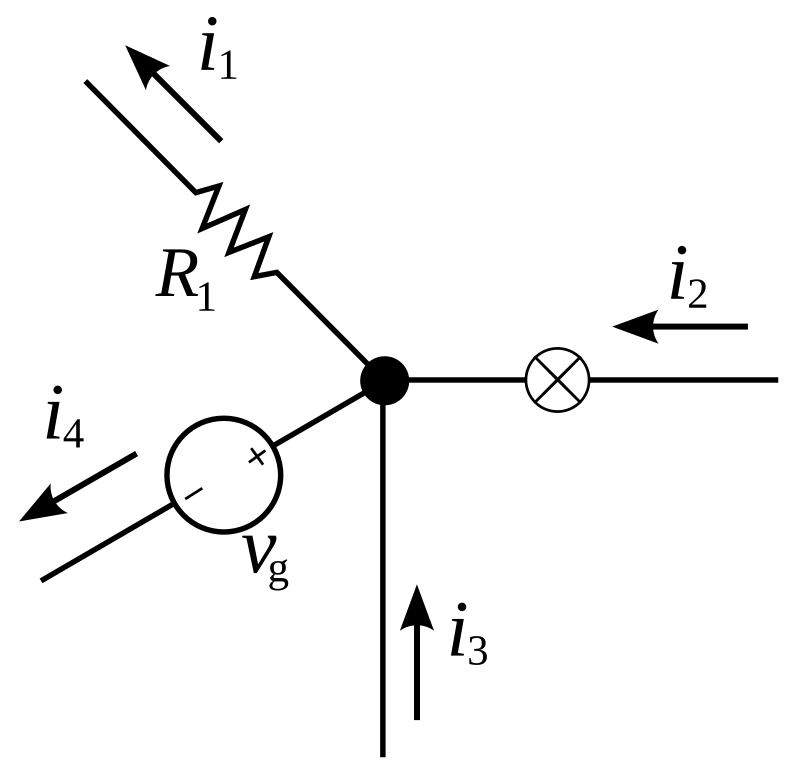
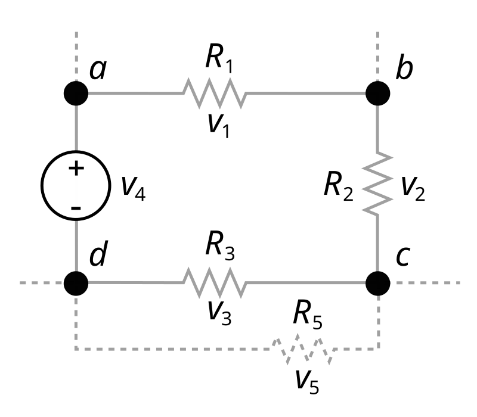

# Devre Teorisi Notları

### Temel Kavramlar

Tabii ki! Elektrik devrelerinde sıkça karşılaşılan yük, akım, gerilim ve güç kavramlarını ve bunların arasındaki ilişkileri açıklayalım.

- **Yük (Q) :** 
Elektrik yükü, bir nesnenin sahip olduğu elektrik miktarını ifade eder ve birimi Coulomb (C) olarak ölçülür. Elektrik yükü, pozitif veya negatif olabilir ve elektronların hareketiyle taşınır.

- **Akım (I) :**
Elektrik akımı, elektrik yüklerinin bir iletken üzerinden akışını ifade eder. Akımın birimi Amper (A) olup, bir saniyede bir Coulomb yükün akışını temsil eder. Akım, genellikle bir devredeki elektronların hareketiyle oluşur ve iki türü vardır:Doğru Akım (DC),Alternatif Akım (AC)

- **Gerilim :(V)**
Elektrik gerilimi, iki nokta arasındaki potansiyel farkı ifade eder ve birimi Volt (V) olarak ölçülür. Gerilim, elektrik yüklerinin hareket etmesi için gerekli olan itici kuvveti sağlar. Bir devredeki gerilim, genellikle bir pil veya güç kaynağı tarafından sağlanır.

- **Güç (P) :**
Elektrik gücü, bir devredeki elektrik enerjisinin dönüşüm hızını ifade eder ve birimi Watt (W) olarak ölçülür. Güç, gerilim ve akımın çarpımıyla hesaplanır:
$$ P = V \times I $$

---

### Ohm Kanunu Nedir?

Ohm Kanunu, bir iletkenin uçları arasındaki gerilim (\(V\)), iletkenin direnci (\(R\)) ve üzerinden geçen akım (\(I\)) arasındaki ilişkiyi tanımlar. Bu kanun, Alman fizikçi **Georg Simon Ohm** tarafından 1827 yılında keşfedilmiş olup şu şekilde ifade edilir:
$$
V = I \times R$$

Bu ifade, bir iletkenin uçları arasındaki gerilim farkının, üzerinden geçen akımla orantılı olduğunu gösterir.

### Ohm Kanunu'nun Kanıtı

Ohm Kanunu doğrudan matematiksel bir kanuna dayanmaz; ancak deneysel olarak doğrulanmış bir ilişkidir. Bununla birlikte, elektrik akımı ve iletkenlik mekanizmaları incelenerek teorik olarak da açıklanabilir.Bunu kanıtlamak için bilmemiz gereken farktorler

#### 1. Elektriksel İletkenlik ve Direnç
Bir iletkenin elektriksel direnci, malzemesine, uzunluğuna ve kesit alanına bağlıdır. Direnç şu formülle ifade edilir:
$$
R = \rho \frac{L}{A}$$

Burada:
- \( \rho \) (rho): Malzemenin **özdirenci** 
- \( L \): İletkenin **uzunluğu** (m)
- \( A \): İletkenin **kesit alanı** (m²)

#### 2. Akım Yoğunluğu ve Ohm Kanunu

Akım yoğunluğu (\(J\)), iletkenin **birim kesit alanı** başına düşen akımdır:

$$ J = \sigma E$$

Burada \( \sigma \), malzemenin **iletkenliği** olup şu şekilde ifade edilir:

$$\sigma = \frac{n e^2 \tau}{m}$$

İletkenlik ve malzeme öz direnci ters orantılıdır.

$$\sigma = \frac{1}{\rho}$$

BU ilişkilerdeki sabitle göz önünden çıkarıldıgında ortaya ohm kanunu ortaya çıkmaktadır.

### Kirchhoff kanunları

Kirchhoff yasaları karmaşık devrelerin analizinde kullanılan, elektrik yükünün ve enerjisinin korunumuna dayalı, ilk kez 1845 yılında Gustav Kirchhoff (Kirhhof okunur) tarafından tanımlanan iki eşitliktir.

#### 1. Kirchhoff'un akım yasası

#### 2. Kirchhoff'un gerilim yasası

